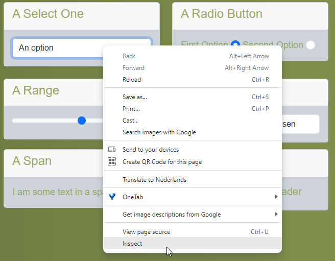
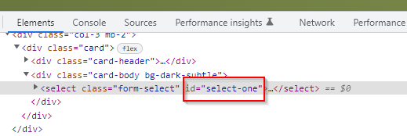
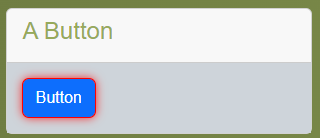

# HTML Selecting based on ID

The goal of this exercise is to be able to select elements based on id.

## Context

The easiest way to select elements is based on id.

Why selecting on id is very easy:

1. Find the id of the element you want to select
    1. Right-click on the element
    2. Select inspect 
    3. The developer tools will open
    4. You can find the id (if there is one) in there 
2. That's it you can select your element!

## Downsides

An id will not always be available. So this method might not always work.
There are a few reasons:

1. Developers have, besides a few exceptions, no reason to add an id to an element for development purposes.
    1. The main reason to add ids is for testing purposes. So good cooperation between testers and developers is
       required.
2. There are a lot of elements in a web page (for example in our little testing page there are 148 elements!)
    1. Adding unique ids to everything will cost a lot of time (and money).
3. Some elements are automatically generated
    1. If this is done by an external library, adding ids is not possible.
    2. If this is done by code of your team, they can add automatically generated ids.
        1. However, good agreements need to be made to do this properly

To avoid spending hours discussing ids with your developer team, you can use css selectors and xpath selectors to
work around this problem. That is however for the next codelab. Let's try selecting elements first with ids.

## Task list

Go to the [tutorial page](https://archive.switchfully.com/track/test/element-selection/)

For each element in the list:
1. Lookup the id
2. Fill it in the id query search box 
   * 
3. Press enter
4. If done correctly the element should be highlighted in red.
   * 

Highlight the following elements in this fashion:
1. The Button
2. The Link
3. The Text Input field
4. The First Option radio button
5. The Second Checkmark
6. The whole List
7. The whole Table

