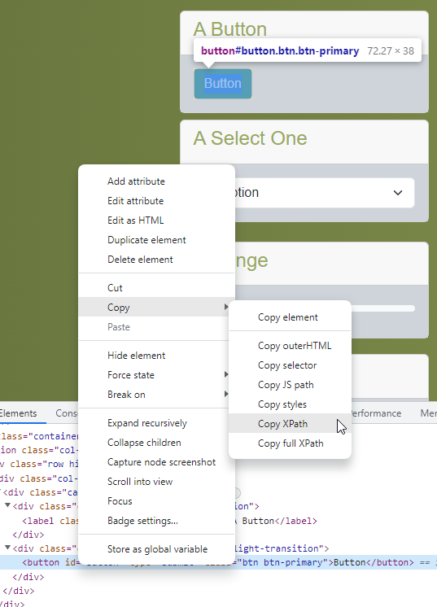

# HTML Selecting based on XPath

The goal of this codelab is to learn how to select elements with XPath

## Context
XPath is the most powerful, but also the most complex way of selection elements

With XPath you can virtually select any element with whatever rule you can think of

For example, you can:
- Select an element based on its children
- Select an element based on its text
- Select an element based on its siblings
- Select an element based on an expression
- And much, much, more

Basic syntax:
* `//` starts your xpath
* `*` is a wildcard and means everything (so `//*` means all elements)
* `//p` selects all paragraph elements
* `[]` places some restrictions on the selected element
  * `[1]` will select the first element of the selected elements (so `//div[1]` will select the first div element)
  * `[@id='id']` will select only the elements with id='id' of the selected elements (so `//input[@id='firstname']` will select the input element with id='firstname')
  * `[contains(@class, 'class')` will select only the element of which the list of classes contains 'class' (so `//head[contains(class,'header')]` will select the head element that has the class header)
  * `[p]` will select only the elements that have a paragraph-element as a child. So `//div[p]` will select all divs that have p as a direct child 
* `/` will select the direct child. So `//p/span` will select all spans that are in a paragraph.
* `text()` will return the text of an element. So `//*[text()='Title']` will return all elements with text Title. 

### How to select an element?

Your browser can construct a xpath for you:
1. Right-click the element you want to select
2. Select inspect
3. The developer tool will open
4. Right-click the tag in the developer tools
5. Choose `Copy` -> `Copy XPath` 
6. You have a xpath for the element!

Be careful! While the browser will create a valid xpath for you, it is always good to check that the selector makes sense.
Also, using this method you can only select one element at a time. Sometimes you'll need to select multiple elements.

How to select multiple elements?
1. Learn the xpath syntax
2. Construct a selector manually with your knowledge of the webpage

### Disadvantages
While being a more powerful tool than css selectors, xpath has some drawbacks:
* it is slower than a css selector
* it has a more complex syntax making it harder to understand
* it's behaviour can change depending on the browser

## Task list

Go to the [tutorial page](https://archive.switchfully.com/track/test/element-selection/)

For each element in the list:
1. Create a Xpath (manually or by the browser)
2. Fill in the selector in the xpath query search box
3. Press enter
4. If done correctly the element should be highlighted in red
   
Highlight the following elements in this fashion:
1. The Password input field
2. The Second Checkmark
3. The label `First Checkmark` (not the button) of the first radio button
4. The header `A Paragraph`
5. The last element in the list
   1. If you want you can try to use `last()`
6. The last column of the first row of the table

Highlight the following group of elements:
1. All the panels (cards) on the screen
2. All input elements
3. All label elements with class h4
4. All body elements of the panels
5. All div elements that are a direct child of a div with class row
6. All input elements with type 'search'
7. All buttons with type 'submit'
8. All columns of the 2nd row in the table
9. The table element with the word Snow
10. Selecting the word that User 1 likes in the table
    1. If you refresh the page the XPath should keep working
11. All divs that have an input element as a direct child
12. The word that comes before Soup in the list (if there is one)
    1. If you refresh the page the XPath should keep working
