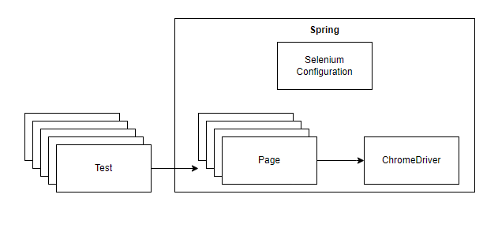

# Spring Boot Selenium Test

In this codelab you'll learn how using Spring Boot will further simplify your selenium tests.

## Context
We've come pretty far with organizing our tests. Still another problem remains.
This problem becomes clear when we create a 2nd test class.
In this 2nd class we need to do the same setup for our webdriver and our page class. Duplication!

With Spring Boot we can move this setup to a separate configuration file. 
This will not only remove the need to do the same setup for every test class, it will also put the setup in a more easy to find place.

## Task list
### WebDriver as a Spring Bean
Make the Chrome Driver a bean
1. Create a SeleniumConfiguration class.
   1. Add the @Configuration annotation
2. Create method in the configuration class that will create a ChromeDriver Bean
   1. The method should set the proper system property (just like in the setUp method)
   2. Should create and return a new ChromeDriver
3. Add the appropriate annotation to this method to transform it into a bean

Make your test a Spring Boot test (do this for both your tests)
1. Add the @SpringBootTest annotation
2. Make it load your SeleniumConfiguration
3. Instead of creating the ChromeDriver autowire it from Spring Boot instead
4. Remove the lines that are for creating and configuring the Chrome Driver from your setUp method.
5. Remove the tearDown method.
6. Run your tests. They should work.

### Auto close
You might notice that we're not calling `driver.quit()` anymore. What's happening?
Well, Spring Boot recognizes that the bean is a ChromeDriver and will call the quit method for us automatically after each test. 
Handy!

### Pages as Spring Beans
We still are creating the page object in our setup method. This can be done by Spring Boot as well.

1. Add the @Component annotation to your page class.
2. In SeleniumConfiguration at @ComponentScan so that the page class will be discovered
3. In your tests instead of creating the Page object in the setUp method, autowire it instead.
4. Run all your tests. The 2nd test should fail with a NoSuchSessionException. What is happening?
   1. Spring calls quit() on the ChromeDriver after every test. However, it doesn't always start up a new Chromedriver.
   2. The solution? Tell Spring to only close the ChromeDriver **after** all the tests have run.
   3. In SeleniumConfiguration add the `@Scope("singleton")` annotation to your ChromeDriver bean definition.
5. Run your tests again. They should work this time.


### PageFactory
If everything went well the only line remaining in your setUp method is: `PageFactory.initElements(driver, elementSelectionPage);`
We can get rid of this by letting the page call this instead of the test.
1. In your Page class add the following method.
```java
@PostConstruct 
public void init() {
    PageFactory.initElements(driver, this);
}
```
2. You can now remove the setUp method from your tests.
3. Notice that you are also not using the ChromeDriver field in your tests anymore. You can remove that one as well!

## Summary

You've learned in this codelab how Spring Boot will help you to organize your configuration a more structured way.

You should by now understand the conventional structure of a selenium test, as seen in the diagram below.


## What's next?

In the next codelab we'll see how we can create a selenium test for a testing scenario.
