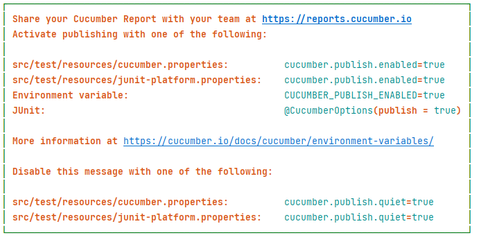

# Make Maven run Cucumber

In this codelab you'll learn how you can make Maven run your Cucumber tests.

## Context
Test frameworks are usually executed by tools like Maven or Gradle.
To make Maven discover and run our Cucumber tests we need additional libraries.

But wait, I hear you say, haven't we executed Cucumber already? Why do we need Maven? Intellij can do everything that we need!
Well, installing and maintaining Intellij on all our testing servers will take a lot of time and cost a lot of money.
Maven is a much cheaper and precise tool for that job.

### How do we do this?
Maven can run JUnit tests, so the only thing we need to do is to tell JUnit to run Cucumber tests.

## Goal
When we run `mvn test` in the commandline, it will execute our Cucumber test

## Cucumber Junit Platform Engine
1. Add the following dependency
```xml
<dependency>
   <groupId>io.cucumber</groupId>
   <artifactId>cucumber-junit-platform-engine</artifactId>
   <version>7.11.1</version>
</dependency>
```
This is the library that Intellij was using behind the scene to run the Cucumber tests.
It allows JUnit to run our Cucumber tests.

We however do need one more thing

## Junit Platform Suite Engine
This very common library allows to run many JUnit classes at once. It's an extension of the basic JUnit Platform.
Cucumber has decided that it will use this feature to run it's test. So we'll need to add it as well.

1. Add the following dependency
```xml
<dependency>
   <groupId>org.junit.platform</groupId>
   <artifactId>junit-platform-suite-engine</artifactId>
   <scope>test</scope>
</dependency>
```

## Configuring the suite
Now we have to create a JUnit suite that will run our Cucumber tests.
1. Create a RunCucumberTest class
2. Annotate it with `@Suite`
3. Run the suite. It should fail with the message: `Suite [com.switchfully.RunCucumberTest] did not discover any tests`
4. What is happening? JUnit doesn't know where to find our tests. You can tell it to look in the `features` folder by adding the annotation `@SelectClasspathResource("features")`
5. Run your suite again. It should execute your Cucumber test.
6. Run `mvn test`, either in the terminal or in the Maven menu of Intellij. It should execute your Cucumber test!

That's it! Your Cucumber test can now be executed by Maven.

## Additional conventions
It's advised to add the following annotations as well to the suite.

### Include Engines
This annotation will tell the suite that it needs to look for cucumber tests. 
Now it does this by default since it is the only special engine available to JUnit (our Cucumber Junit Platform Engine dependency).
This default will no longer work if you would add another engine.
1. Add `@IncludeEngines("cucumber")` to your suite.

### @ConfigurationParameter(key = GLUE_PROPERTY_NAME, value = "com.switchfully")
This annotation will tell Cucumber where to look for the Steps classes.
By default, Cucumber will look in the package (and all its child packages) of the suite class.
Depending on your project this might be not the place your Steps are located.
Just to be safe add this one.

## Additional scenario's
Add the following scenario's to your `basic_calculation.feature`
1. Subtracting 2 from 4
2. Multiplying 5 with 4
3. Dividing 34 by 17

## Tags
Sometimes you want to group certain scenario's together, or skip certain ones.
This is easily done with tags.

1. Add the following above the scenario's for addition and multiplication `@commutative`
2. Copy RunCucumberTest and name it RunCommutativeTest
3. In RunCommutativeTest add the following annotation `@IncludeTags("commutative")`
4. Run RunCommutativeTest. It should only run the scenario's annotated with `@commutative`

You free to choose the name of your tags.
To exclude certain scenario's you can use `@ExcludeTags(<tag-name>)`

## Configuration
Lastly, Cucumber JUnit has many configuration options that you can explore at [cucumber-junit](https://github.com/cucumber/cucumber-jvm/tree/main/cucumber-junit-platform-engine).

For example, want to get rid of this report message at the end of your test?



Add the following annotation to get rid of it: `@ConfigurationParameter(key = PLUGIN_PUBLISH_QUIET_PROPERTY_NAME, value = "true")`

## (Optional) Multiple feature files
With the Suite set up we now can run multiple feature files at the same time.
1. Create a new feature file and add a scenario (you can pick any simple multiplication)
2. Run the suite. The scenarios of both feature files should run.

## Summary

In this codelab you've learned how you can make JUnit use Cucumber and let Maven run your tests.
Additionally, you've seen how you can configure Cucumber.

In the next chapter we'll see how Cucumber can make use of Spring.
