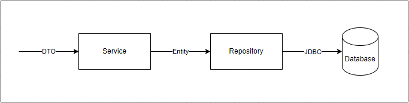

# Spring Boot Codelab 03

The goal of this codelab is to learn how to write tests for a Spring Boot project

## Context

The following picture shows a general but simplified way a java enterprise application is build

You can find an implementation for this in the `src/main/java` files.

### Steps
The following steps explain the process in more detail (don't worry you don't need to remember them)
1. A caller will call a method on the Service with a DTO (Data Transfer Object).
2. The service will transform the DTO to an entity
3. The service will call a method on the repository with the entity as an argument
4. The repository will translate the method call to a SQL query and send it to a database
5. The database will respond to the query
6. The repository will translate the response from the database and send it to the service
7. The service will translate the response of the repository and send it to the caller

### What to remember?
In this diagram both the Service and the Repository are Spring Beans.
The database is set up by Spring Boot as well.

You can test a Spring Boot project by:
1. Autowiring the bean you want to test.
2. Calling the appropriate methods on the bean.

## Task list
1. Make AddressServiceTest a Spring Boot Test
   1. You don't need to create a TestConfig file. There is an Application file available, which will replace the TestConfig file automatically.
2. Autowire the beans in the test.
3. Write the code for the following tests (more explanation in the test itself):
   1. Save address
   2. Get address by id
   3. Get all addresses
   4. Delete an address by id
