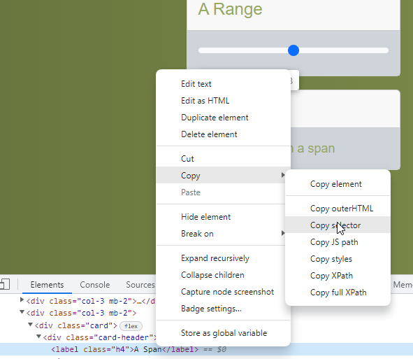

# HTML Selecting based on CSS Selectors

The goal of this codelab is to learn how to select elements with css selectors

## Context
CSS selectors have some advantages compared to id selecting.

With CSS selectors you can:
- select based on id
- select based on tag-name
- select based on css class name
- select children of a selection by combining two selections together
- ...

How does this work?
- `#<id>` to select based on id
- `<tag>` to select based on tag name
- `.<class>` to select based on css class
- `<selection1> > <selection2>` will select all elements that are selected by selection2 and that have a direct parent that is selected by selection1

All css selectors can return multiple results.

Some examples :
- `#css-query` will select all elements with id `css-query`
- `div` will select all `
` elements
- `.header` will select all elements with `class='header'`
- `ul > li` will select all `<li>` elements that have an `<ul>` element as a direct parent

### How to select an element?

Your browser can construct a selector for you:
1. Right-click the element you want to select
2. Select inspect
3. The developer tool will open
4. Right-click the tag in the developer tools
5. Choose `Copy` -> `Copy selector` 
6. You have a css selector for the element!

Be careful! While the browser will create a valid selector for you, it is always good to check that the selector makes sense.
Also, using this method you can only select one element at a time. Sometimes you'll need to select multiple elements.

How to select multiple elements?
1. Learn the css selector syntax
2. Construct a selector manually with your knowledge of the webpage

## Task list

Go to the [tutorial page](https://archive.switchfully.com/track/test/element-selection/)

For each element in the list:
1. Create a CSS selector (manually or by the browser)
2. Fill in the selector in the css query search box
3. Press enter
4. If done correctly the element should be highlighted in red

Highlight the following elements in this fashion:
1. The Link
2. The First Checkmark
3. The label `First Option` (not the button) of the first radio button
4. The header `A Color`
5. The 2nd element in the list
6. The last column of the last row of the table

Highlight the following group of elements:
1. All the panels (cards) on the screen
2. All input elements
3. All label elements with class h4
4. All body elements of the panels
5. All div elements that are a direct child of a div with class row
6. All input elements with type 'search'
7. All buttons with type 'submit'
8. All columns of the 2nd row in the table
