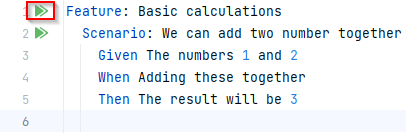

# My first Cucumber test

In this codelab you'll learn how to write basic cucumber tests

## Context
Cucumber test enable the technical part of the BDD practice. 
With cucumber your gherkin files can be automatically executed, providing valuable feedback for the whole team.

## Goal
So, let's say we have the following simple scenario:
```gherkin
Feature: Basic calculations
  Scenario: We can add two numbers together
    Given The numbers 1 and 2
    When Adding these together
    Then The result will be 3
```
Write the necessary code that this can be automatically executed

## Creating our first feature file
1. In your `test/resources` folder create a `features`folder
2. In your `features` folder create file named 'basic_calculations.feature'
3. Copy the above Gherkin syntax in your newly created file

## Adding a steps class
1. Add the following dependency
```xml
<dependency>
    <groupId>io.cucumber</groupId>
    <artifactId>cucumber-java</artifactId>
    <version>7.11.1</version>
</dependency>
```
### Cucumber Java
Your Cucumber tests will need to run java code.
The connection between your Gherkin file and your java code is done with this library

### The Steps Class
1. In your `com.switchfully` package create a CalculationSteps java class.
2. In this class add the following method
```java
@Given("The numbers {int} and {int}")
public void givenTwoNumbers(Integer lefthand, Integer righthand) {
}
```
This method will now be executed when cucumber goes through the first step of your scenario (`Given The numbers 1 and 2`).
3. In similar manner add methods in your Steps class for the `When` and `Then` steps of your scenario.
4. Go to your feature file and run the feature test 
5. The test should succeed, but are we really testing something? Change the '3' in your feature file to a '4'. Run your tests again.
6. This test should still succeed. Add the necessary code to the methods in your steps class to make the test fail (for the right reason).
   1. Hint: You'll need to use instance fields to make this work.
7. Change the '4' back to a '3'. Run your test again. It should succeed.

## Summary

In this codelab we've learned how you can make a basic feature file and bind it your java code.
However, at the moment Intellij is running our tests. 
If we truly want to automate our tests Maven should be able to run them as well.
